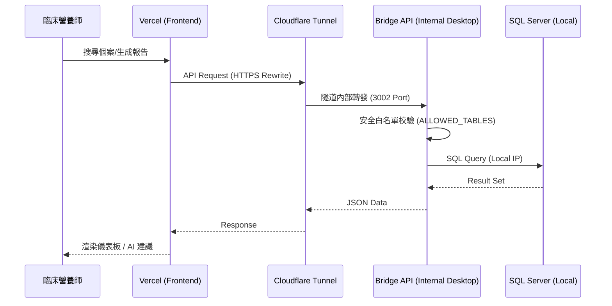
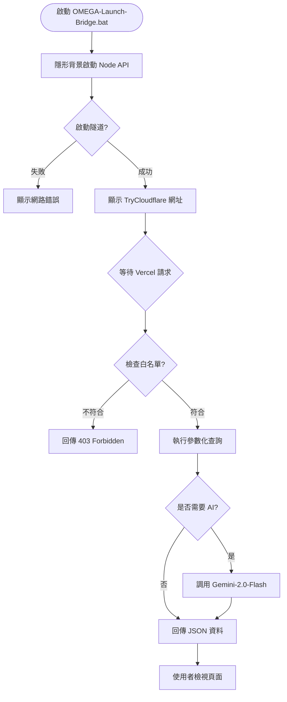
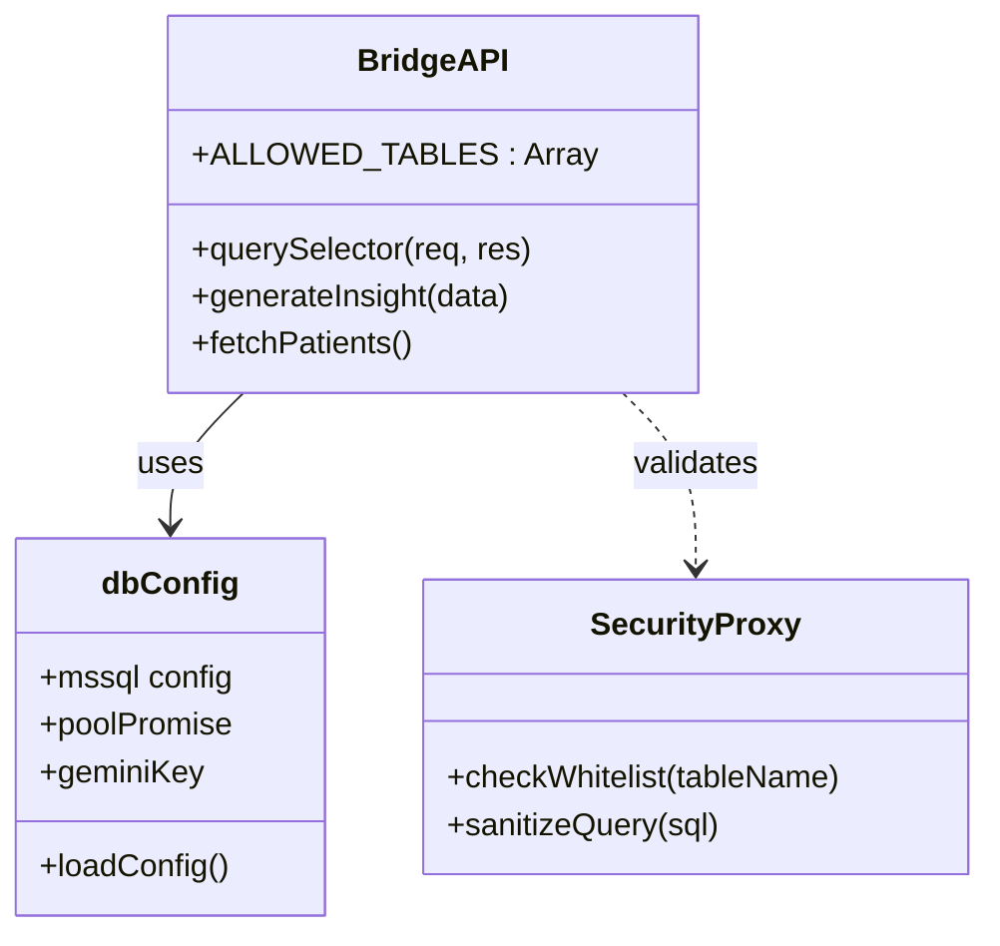
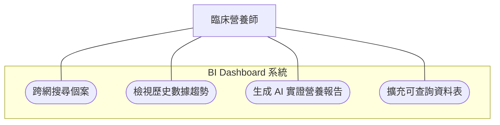
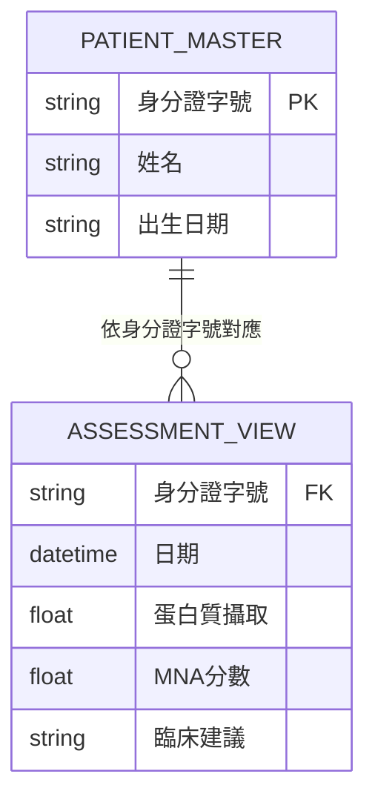

# 養生村高齡營養 BI 儀表板：綜合技術手冊 v2.1 (Technical Manual)

> [!IMPORTANT]
> **本專案係基於「地雲橋接 (Hybrid Cloud Bridge)」技術，為解決醫療/照護機構內網封閉性與資訊安全之最佳實務方案。**

---

## 1. 系統架構視覺化 (Architecture Visualization - Visual 5)

本章節依據 Antigravity 憲法 3.1 條規範，提供五大標準圖表。

### 1.1 數據流循序圖 (Sequence Diagram)
展示資料從使用者請求到 SQL Server 回傳的完整跨網時序。



### 1.2 系統執行流程圖 (Flowchart)
展示系統初始化與運行的邏輯判斷。



### 1.3 組件類別圖 (Class Diagram)
展示地端橋接器與資料庫配置的邏輯結構。



### 1.4 使用者案例圖 (Use Case Diagram)
定義臨床營養師的主要交互場景。



### 1.5 實體關係圖 (ER Diagram)
展示當前橋接器主要對接的資料庫 View 與 Master Table 關係。



---

## 2. 設計原理與設計哲學 (Design Philosophy)

### 2.1 零信任出站橋接 (Zero-Trust Outbound Bridge)
為解決企業防火牆禁止外部連入 (Inbound) 的限制，本系統採用「由內而外」的隧道技術：
- **安全不開洞**：不需要在防火牆開任何 1433 (SQL) 或 80 (HTTP) 端口。
- **加密通道**：透過 Cloudflare 的私有協議對外暴露臨時或固定接口。

### 2.2 唯讀防禦 (Read-Only Defense)
地端 API 嚴格實施「白名單策略」：
- **ALLOWED_TABLES**：只有列在清單中的表/視圖才能被查詢。
- **指令隔離**：後端僅接受特定的 SQL Query 結構，不支援任何 `DELETE`、`UPDATE` 或 `DROP` 操作。

---

## 3. 安裝與環境設定 指南 (Deployment Guide)

### 3.1 地端環境需求
- **OS**: Windows (建議 Windows 10/11 或 Windows Server 2019+)
- **Runtime**: Node.js v18+
- **Database**: MS SQL Server (需開啟 TCP/IP 連線)

### 3.2 快速啟動包說明
針對 AD 域控限制開發了 **「隱形啟動包」**：
1.  **`start-api-silent.vbs`**：呼叫 VBScript 隱藏 Node.js 黑視窗。
2.  **`OMEGA-Launch-Bridge.bat`**：一鍵同時啟動隱身 API 與 顯性隧道。
3.  **`STOP-ALL-SERVICES.bat`**：用於故障排除，一鍵終止所有背景程序。

### 3.3 配置文件 (`.env` 與 `data/SQLDB.txt`)
為確保金鑰安全（防止 GitHub 洩漏），系統採用分離式管理：

1.  **`.env`** (主要存儲敏感金鑰)：
    ```text
    GEMINI_API_KEY=你的金鑰
    ```
2.  **`data/SQLDB.txt`** (存儲資料庫連線資訊)：
    ```text
    SQL_SERVER=127.0.0.1
    SQL_USER=sa
    SQL_PASSWORD=你的密碼
    SQL_DATABASE=你的資料庫
    ```

### 3.4 遠端部署與啟動 (Remote Execution Best Practices)
針對您在「遠端 RDP 主機」上的操作，請務必遵守以下「本地執行」原則以確保系統穩定性。

**關鍵禁令**：
- ❌ **請勿直接在筆記型電腦路徑 (\\tsclient\C) 下執行啟動腳本**。這會導致 Node.js 因為網路延遲而卡死。

**正確操作流程**：
1.  **同步代碼**：在遠端主機執行 `remote-sync-nutrition.bat`，將代碼同步至遠端硬碟（例如 `D:\Senior-Nutrition-BI-Dashboard-v2-main`）。
2.  **切換路徑**：開啟遠端主機的檔案總管，進入 **D 槽的專案資料夾**。
3.  **本地啟動**：在 D 槽資料夾內執行 **`OMEGA-Launch-Bridge.bat`**。
4.  **獲取網址**：看到以 `trycloudflare.com` 結尾的網址後，系統即進入穩定運作狀態。

---

## 4. 資料庫表欄位映射 (Table Mapping)

### 主力 View: `vw_營養系統_迷你營養評估_BI報表`
| 原始欄位名 | 技術標籤 (JSON) | 說明 |
| :--- | :--- | :--- |
| [身分證字號] | id | 唯一識別與 Join 用鍵值 |
| [日期] | assessment_date | 評估執行日期 |
| [MNA_總分] | mna_score | 迷你營養評估結果 |
| [飲食攝取量] | intake_val | 實際攝取數據 |

---

## 5. 維護與故障排除 (Troubleshooting)

- **Q: 隧道網址過期？**
  - **A**: 重新執行 `OMEGA-Launch-Bridge.bat` 取得新 URL 並回報。
- **Q: 資料抓不到？**
  - **A**: 檢查地端 SQL Server 之 TCP 1433 是否有被本地 Windows Defender 擋住。
- **Q: AI 生成緩慢？**
  - **A**: 確認 Gemini API Key 之連線頻寬或額度。

---
**本文件由 OMEGA (Chief Full-Stack Architect Sherluck) 自動生成。**
**最後更新日期：2026-04-10**
